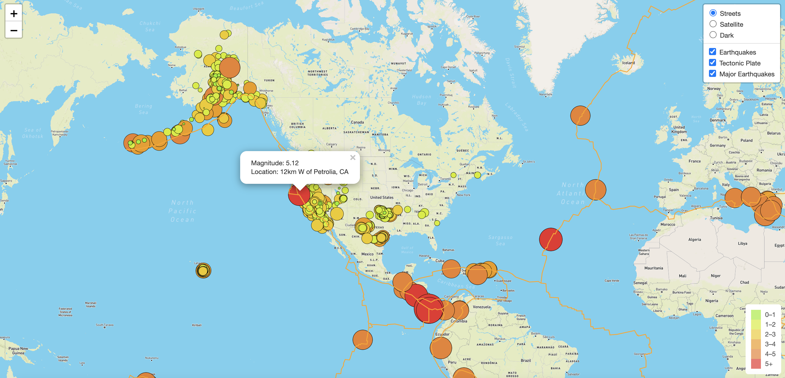

# Mapping-Earthquakes

## Overview of Analysis

The purpose of this project is to create a map to analyze th

This analysis will focus creating a map to see the earthquake data in relation to the tectonic plates’ location on the earth, the earthquakes with a magnitude greater than 4.5 on the map, and additional data on a third map.

## Results

The data preparation utilizes Leaflet.js, Javascript, HTML and CSS to analyze and create map on a webpage. The webpage is generated on the <a href="Earthquake_Challenge/index.html">index HTML webpage file</a>. 

The webpage is created by utilizing various geoJSON  files online to make an <a href="Earthquake_Challenge/static/js/challenge.logic.js">application</a>. The webpage also utilizes <a href="Earthquake_Challenge/static/css/style.css">CSS</a> to make it easy to read and more aesthetic.  

### Overview of Map Webpage

The map is extremely dynamic and has various layers to further the analysis. In the webpage, there are 3 key layers to highlight:

**1. Earthquake Data**

The earthquake data showcases overall earthquake data. Each earthquake has a circle with a radius relative to the size of the earthquake. Each circle will have a popup marker for each earthquake to display the magintude and location of the earthquake. There is also a legend with a color scale in the bottom right to showcase the magnitutde from 1 to 5+.

**2. Tectonic Plat Data**

The tectonic plate data is added to showcase the where the tectonic plates lie. This will be showcased with an orange line.

**3. Major Earthquake Data**

The major earthquake data showcases earthquake data for earthquakes with a 4.5+ magnitude. Similar to the earthquake data, these data points will also have a circle radius, popup marker and will follow the current legend and color scale.

### Addiitional Map Style

The map also allows the end user to view the map in 3 different styles:

1. Streets
2. Satellite
3. Dark

